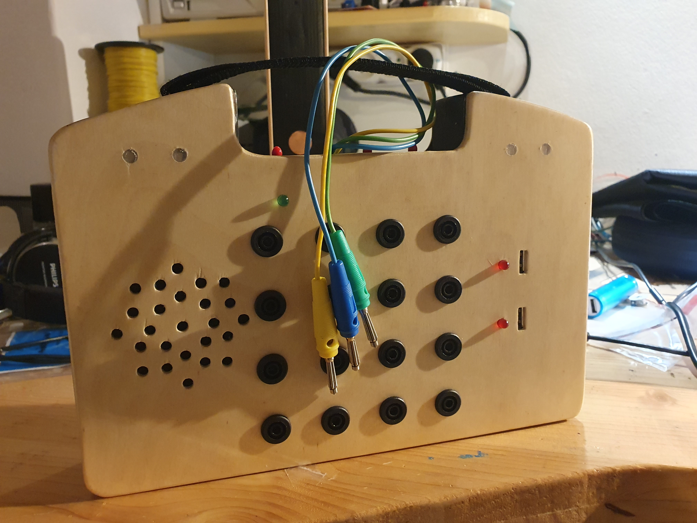

# Switchboard 

A very simple switchboard for little kids made from scrap parts for xmas. Contains a DFplayer mini with a speaker, a vibration motor, and a Neopixel LED as outputs. Each is connected to a banana connector wire that can be plugged in into a 3x3 switchboard. Depending on where it's plugged, different stuff happens. Uses ATmega324p at its heart and lots of glue. 

Also 2 extra switches for USB power kids can plug their devices to (such as lights & LEGO motors). 5000mAh power bank to power the whole thing. 

## ATMega324pa

- [https://www.engbedded.com/fusecalc/] for fuses calculator
- needs external oscillator to work properly
- uses avrdude & usbtiny to program
- make sure the -D is not passed to avrdude by specifying own upload command

## DFPlayer

- [https://wiki.dfrobot.com/DFPlayer_Mini_SKU_DFR0299] 
- [https://circuitjournal.com/how-to-use-the-dfplayer-mini-mp3-module-with-an-arduino#preparing-sd-card]
- won't register as working unless there is some mp3 to play

## Devel Server

- picocom -b 115200 /dev/ttyAMA0
- C-a C-q to exit
- udev rules for avrdude non-root access